# README
[](https://deploy.stdlib.com/)

# Build a Custom Slack + Airtable Task Management Application

In this tutorial, we will build a Slack application to track team tasks in Airtable. Our Slack app will ask registered team members what they're working on and record their responses in Airtable. We'll program our app to run once a week on Monday, but you'll learn to configure it to run daily, hourly and minutely if you'd like. You'll also have the option to customize the message that your Slack app sends.

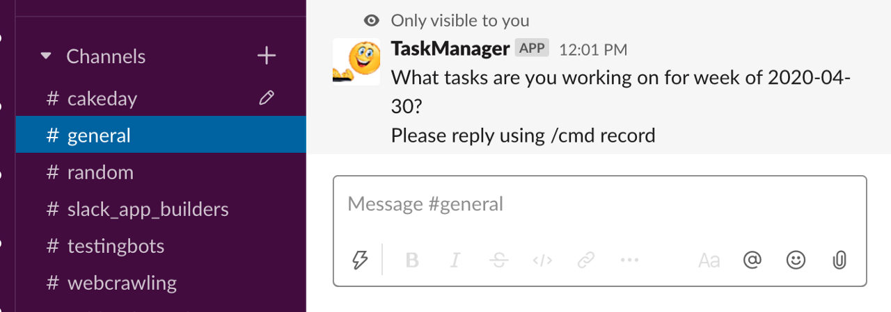

The Slack app will run on [Standard Library](https://stdlib.com), a
free-to-use API and workflow hosting platform, **powered by Node.js**, that will
use this repository as its project structure. Standard Library will automatically
handle Slack API authentication/webhook signing and more for you, so you can
focus on writing and modifying logic.

# Use Case


# Table of Contents

1. [How It Works](#how-it-works)
1. [Installation](#installation)
1. [Dive into the Code] (#dive-into-the-code) 
1. [Making Changes](#making-changes)
   1. [via Web Browser](#via-web-browser)
   1. [via Command Line](#via-command-line)
1. [Support](#support)
1. [Acknowledgements](#acknowledgements)

# How it works 

After installation, you will run `/cmd getmembers` from your Slack workspace. This command will trigger a webhook hosted on Standard Library to populate an Airtable base with all the active members in the workspace. You can then select the team members you'd like to have your app message to track tasks.

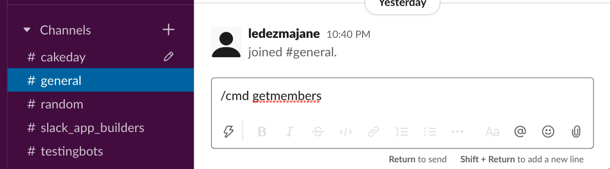

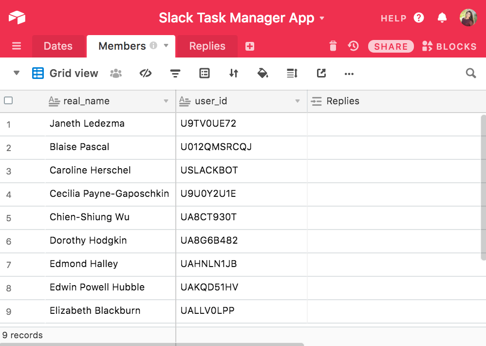

Once every week your Slack app will search through the `Dates` table to find the current date where the `wasSent` field is unchecked and the `status` field is `pending`.

If these conditions are met, then your Slack app will send a private message to each of the users in the `Members` table. Once all messages are delivered it'll check off the wasSent field.


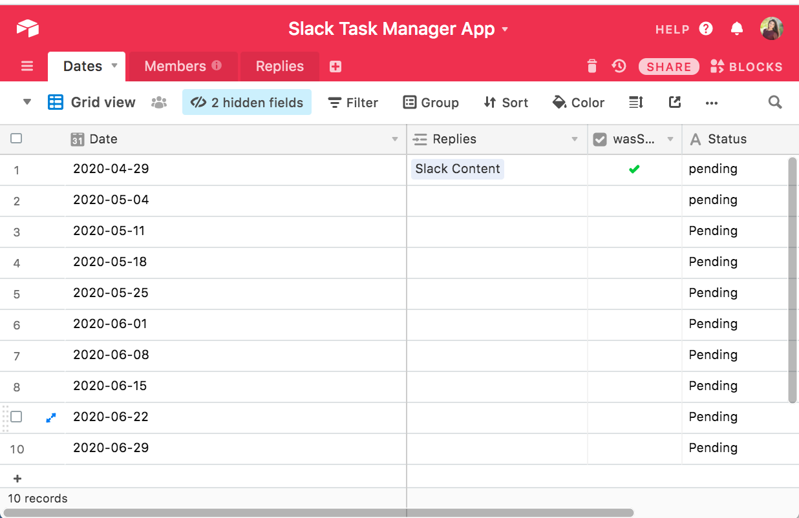

A user can then reply with the tasks their working on by invoking the command `/cmd record <text> `for example:
`/cmd record Content: Build a Custom Slack + Airtable Task Management Bot`

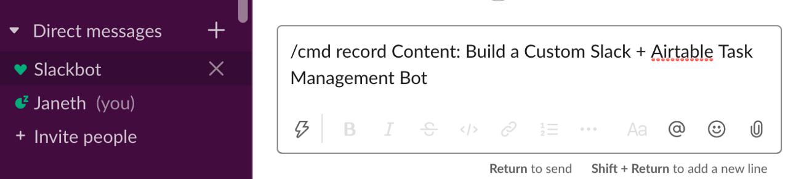

The Replies table will automatically populate with the respondent's reply and it'll be linked to the user's real_name on Members table and Date.

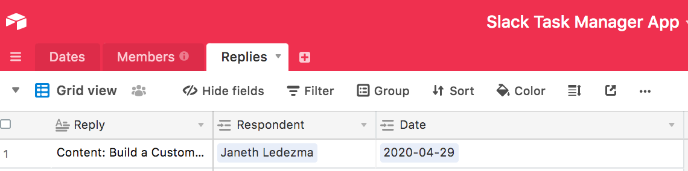

# Installation

Click this deploy from Autocode button to quickly set up your project in Autocode.

[](https://deploy.stdlib.com/)

You will be prompted to sign in or create a free account. If you have a Standard Library account click Already Registered and sign in using your Standard Library credentials.
Give your project a unique name and select Start API Project from Github:

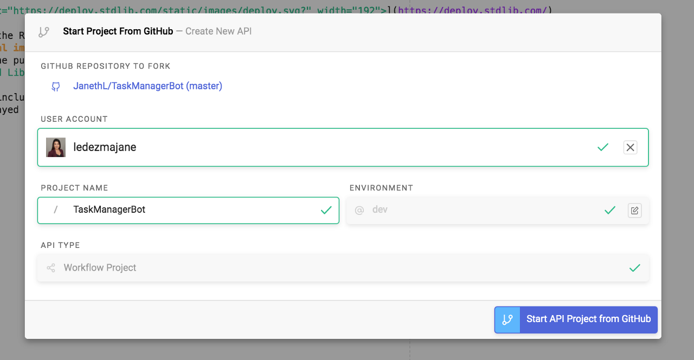

Autocode automatically sets up a project scaffold to save your project as an API endpoint.
To deploy your API to the cloud navigate through the `functions/events/scheduler` folders on the left and select `weekly.js` file.

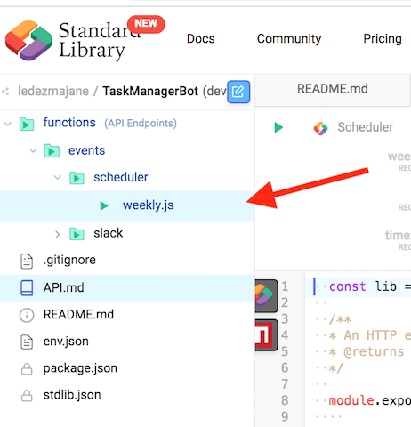

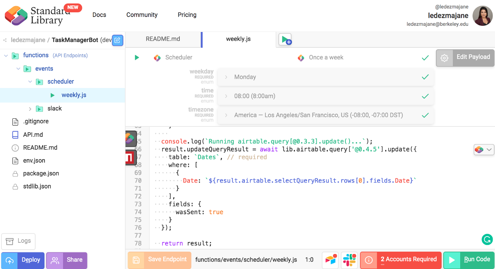

Select the red Account Required button, which will prompt you to link Slack and Airtable accounts.

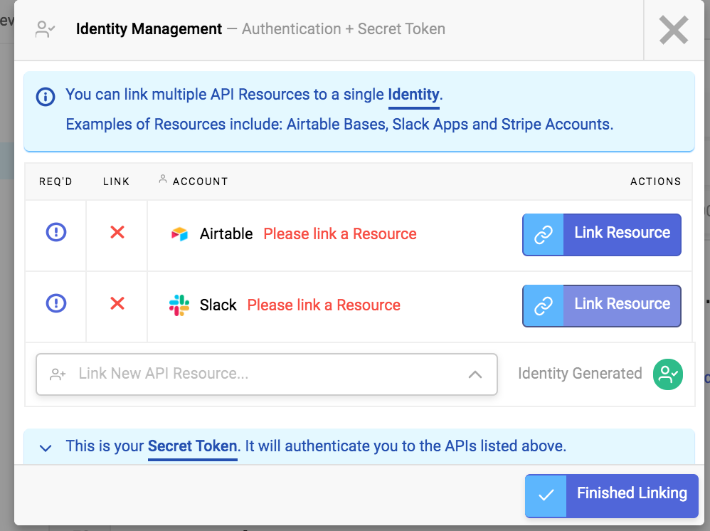

Let's start by linking a Slack Resource. Select Link New Resource to link a new Slack app.

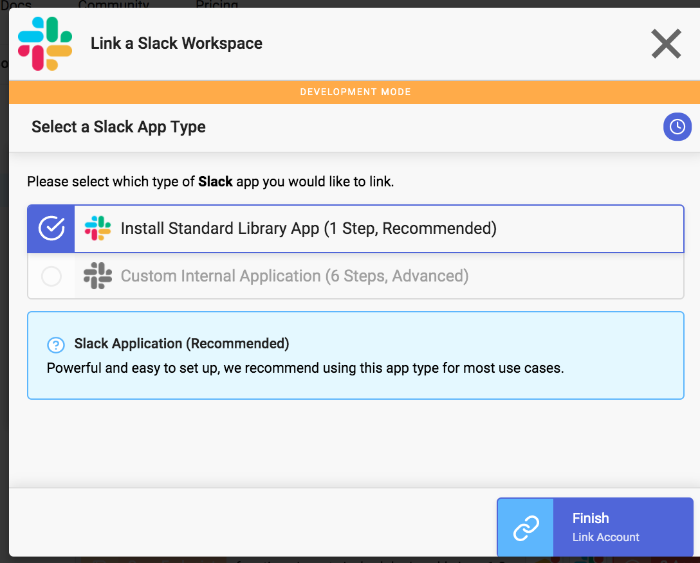

You should see an OAuth popup. Select the workspace you'd like to install your Slack app in, and click Allow.

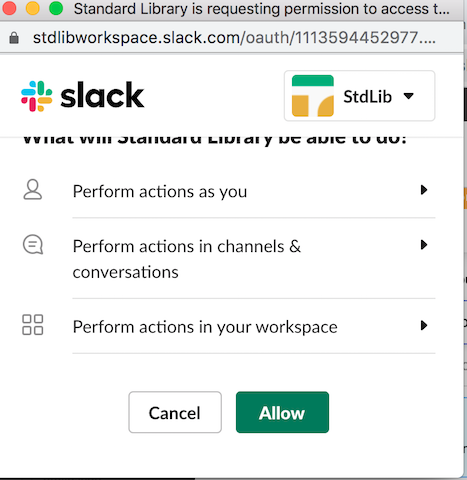

Give your Slack app a name and image if you'd like.

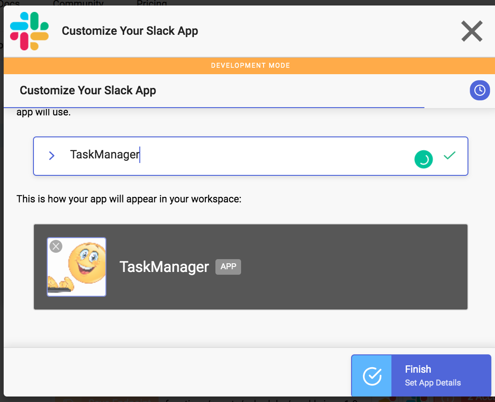

Select Finish. Next select Link Resource to connect to your Airtable account by following the instructions on the modal to retrieve your Airtable API Key and select finish.

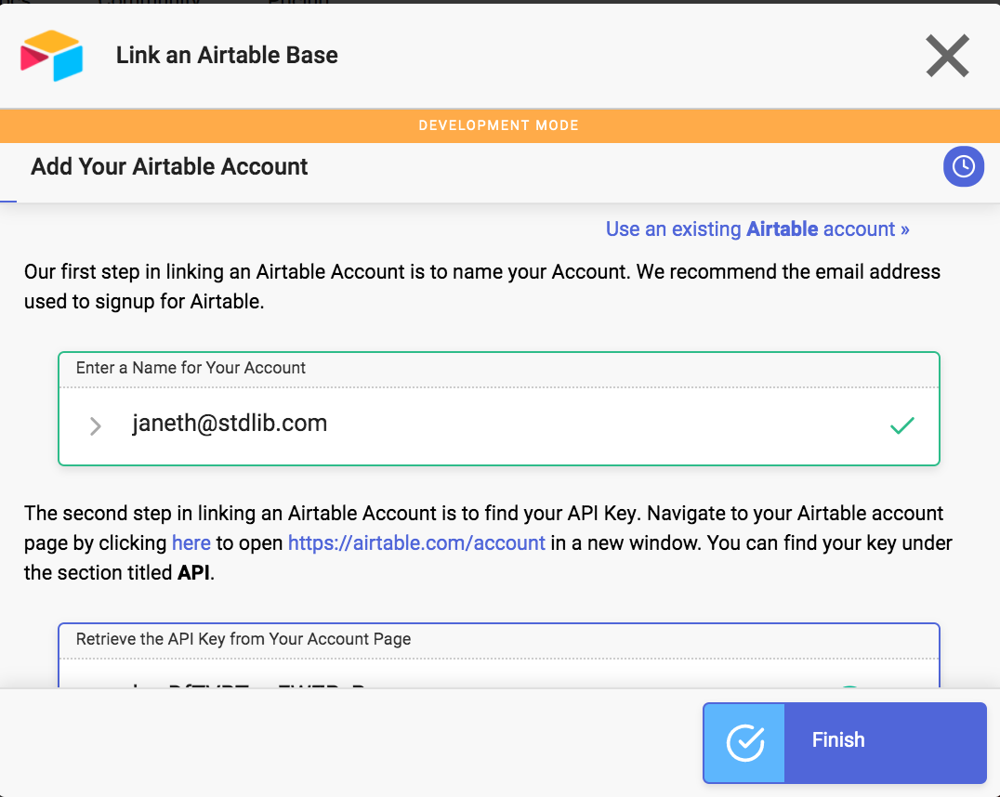

Find and select your Base and click Finish.

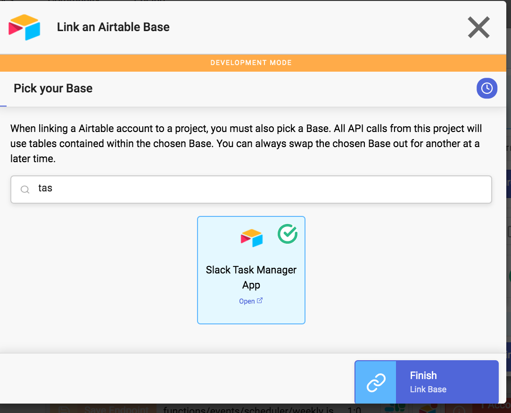

The green checkmarks confirm that you've linked your accounts properly. Select Finished linking.

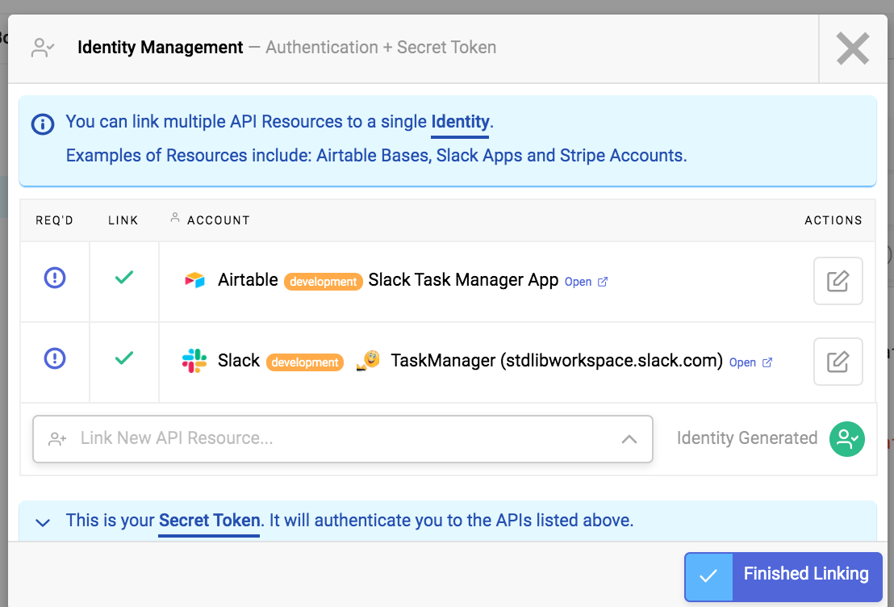

You're ready to deploy your Slack App select Deploy in the bottom-left of the file manager.

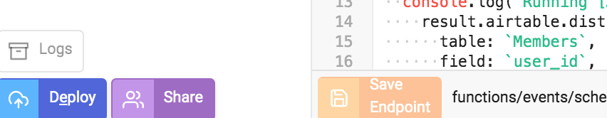

Your Slack App is now available for use in the Slack workspace you authorized it for.  
The final step is to populate the Members Airtable with active members in your workspace by running `/cmd getmembers` from any channel in Slack. 


You can then select the team members you'd like to have your app message.


Your Slack app is ready! It'll query your Airtable for user_ids to send users a private message in the #general channel every Monday at 8:00 am PST.


#Dive into the Code

When a user type's \cmd getmembers a webhook on Standard Library is triggered. To open up the file for the command navigate through the `/functions/slack/command` folders and select `/getmembers.js` file: 

``` Javascript
const lib = require('lib')({token: process.env.STDLIB_SECRET_TOKEN});

/**
* An HTTP endpoint that acts as a webhook for Slack command event
* @param {object} event
* @returns {object} result Your return value
*/
module.exports = async (event) => {

  // Store API Responses
const result = {slack: {}};

  console.log(`Running [Slack → List all users]...`);
  result.slack.returnValue = await lib.slack.users['@0.3.32'].list({
    include_locale: true,
    limit: 100
  });

const activeMembers = result.slack.returnValue.members.filter(members => members.is_bot == false);

console.log(activeMembers);

  console.log(`Running [Airtable → Insert Rows into a Base]...`);
  for (var i = 0; i < activeMembers.length; i++) {
  await lib.airtable.query['@0.4.5'].insert({
    table: `Members`,
    fieldsets: [
      {
        'real_name': `${activeMembers[i].profile.real_name}`,
        'user_id': `${activeMembers[i].id}`
      }
    ]
  });
  }
  
```
The first line of code imports an [NPM](https://www.npmjs.com/package/lib) package called “lib” to allow us to communicate with other APIs on top of Standard Library:

`const lib = require(‘lib’)({token: process.env.STDLIB_SECRET_TOKEN});` 

You can read more about API specifications and parameters here: https://docs.stdlib.com/connector-apis/building-an-api/api-specification/

**Lines 3–7** is a comment that serves as documentation and allows Standard Library to type check calls to our functions. If a call does not supply a parameter with a correct (or expected type) it would return an error. This specific API endpoint is expecting information about the event in an `{object}` and will return response data in an `{object}`.

**Line 8** is a function `(module.exports)` that will export our entire code found in lines 8–34. Once we deploy our code, this function will be wrapped into an HTTP endpoint (API endpoint) and it'll automatically register with Slack. Every time the slash command `\cmd getmembers` is invoked, Slack will send that event's payload of information for our API endpoint to consume.

**Line 11** `const result = {slack: {}}` declares a `result` variable to store response data in an object from the following request to  Slack API.

**Lines 14–17** make a request to `lib.slack.users['@0.3.32']` to retrieve a list of users information and stores  the response data inside our `result` variable as `result.slack.returnValue.` You can view the `result` object by selecting `Run Code.` When you select Run Code Autocode will simulate a slash command event on Slack and the response will be visible in the logs right below the `Run Code` button. API Responses are highlighted in green.


**Line 19** we define the variable `activeMembers` and filter through the list to retrieve only active members from `result.slack.returnValue.members.` We will select users' `real_name,` and `user_id` from this response and pass this data into our subsequent Airtable API request.

**Lines 24** uses a `for` loop to iterate through `activeMembers`. The `for` loop grabs all users'  `real_name`, and `user_id` and maps those to the Airtable fields: `real_name`, `user_id` via a request to `lib.airtable.query['@0.4.5'].`


---

To open up the file running the weekly messages from your Slack app, navigate through the `/functions/events/scheduler` folders and select `/weekly.js` file on your Autocode project.

``` Javascript
  const lib = require('lib')({token: process.env.STDLIB_SECRET_TOKEN});
  
  /**
  * An HTTP endpoint that acts as a webhook for Scheduler daily event
  * @returns {object} result Your return value
  */
  
  module.exports = async () => {
    
  // Store API Responses
  const result = {airtable: {}, slack: {}};
  
  console.log(`Running [Airtable → Retrieve Distinct Values by querying a Base]...`);
    result.airtable.distinctQueryResult = await lib.airtable.query['@0.4.5'].distinct({
      table: `Members`,
      field: `user_id`,
      limit: {
        'count': 0,
        'offset': 0
      },
    });
    
  const momentTimezone = require('moment-timezone'); // https://momentjs.com/timezone/docs/
  let date = momentTimezone().tz('America/Los_Angeles'); //sets the timezone of the date object to 'America/Los_Angeles'
  let formatted_date = date.format('YYYY-MM-DD');
  
  console.log(formatted_date);
  
  console.log(`Running [Airtable → Select Rows by querying a Base]...`);
    result.airtable.selectQueryResult = await lib.airtable.query['@0.4.5'].select({
    table: `Dates`,
    where: [
    {
    'Date__is': formatted_date,
    'wasSent__is_null': true,
    'Status__is': `pending`
    }
    ],
    limit: {
    'count': 0,
    'offset': 0
    }
    });
    
  console.log(result.airtable.selectQueryResult);
  
  console.log(`Running [Slack → retrieve channel by name ]}`);
  result.slack.channel = await lib.slack.channels['@0.6.6'].retrieve({
    channel: `#general`
  });
  
  console.log(result.slack.channel);
  
  console.log(`Running [Slack → Create a new Ephemeral Message from your Bot]...`);
  for (var i = 0; i < result.airtable.distinctQueryResult.distinct.values.length; i++){
    
  await lib.slack.messages['@0.5.11'].ephemeral.create({
    channelId: `${result.slack.channel.id}`,
    userId: `${result.airtable.distinctQueryResult.distinct.values[i]}`,
    text: `What tasks are you working on for week of ${result.airtable.selectQueryResult.rows[0].fields.Date}? \n Please reply using \/cmd record:`,
    as_user: false
  });
    }
    
  console.log(`Running airtable.query[@0.3.3].update()...`);
  result.updateQueryResult = await lib.airtable.query['@0.4.5'].update({
    table: `Dates`, // required
    where: [
      {
        Date: `${result.airtable.selectQueryResult.rows[0].fields.Date}`
      }
    ],
    fields: {
      wasSent: true
    }
  });

  return result;

};

```
The `weekly.js` code will run once a week on Monday at 8 am PST.

**Lines 14–21** make a request to `lib.airtable.query['@0.4.5']` API to retrieve `user_id` from the `Members` table and stores the results for this query in result as `result.airtable.distinctQueryResult`.


**Lines 23–25** we're using [moment-timezone]{https://www.npmjs.com/package/moment-timezone) npm package to format the date `YYYY-MM-DD` so that when we query the Airtable `Dates` table, we can identify and match the row with the current date.

**Lines 30–43** make another request to `lib.airtable.query['@0.4.5']` to query the `Dates` table. It's looking for rows where `Date` is equal to the current date in format `YYYY-MM-DD` with `wasSent` : `null`, and status : `pending` . If the criteria is met it returns the row and stores it in `result.airtable.selectQueryResult` where we will access it to build the rest of our workflow. The Airtable API returns that information in a JSON object, which can be viewed from Autocode by logging the response: `console.log(result.airtable.selectQueryResult)` (Line 45). When you test run your code, you will view the logged response data right below the Run Code button highlighted in blue.

**Lines 48–50** make a request to `lib.slack.channels['@0.6.6']` to retrieve information for #general channel and stores the response data in `result.slack.channel.` We log the response using: `console.log(result.slack.channel)` (Line 52).


**Lines 55–63** Uses a `for` loop to iterate through the data stored in `result.airtable.distinctQueryResult.distinct.values.` The `for` loop grabs all user_id's and sends a private message to all via `lib.slack.messages['@0.5.11'].ephemeral.create`. We identify the channel we want to post the private message in by setting the value for channelID to: `${result.slack.channel.id}.`

**Lines 66 -76** update our Airtable when the Slack app has sent out the message to users by calling `lib.airtable.query['@0.4.5']`  and setting the`wasSent` field to `true`.


  - Note when test running the code in this make sure all users in Airtable are in the channel where you'll be sending them         the private message.
  - To test your Slack app make sure the Dates table has one row with the current date and the wasSent field is unchecked.
  
---

To open the file for `/cmd record` navigate through `/functions/events/slack/command` folders and select `/record.js` file.

This file behaves like the `getmembers.js` file. When a user submits `/cmd record` a webhook will be triggered and the code inside this file will run.

First, an API call is made to query Airtable for rows in `Dates` table where `wasSent` is checked off and `Status` is `pending`. Then the `Members` table is queried to find the row where the user_id matches the user_id from the event. Next, the `Replies` table is queried to check if the user has submitted a response for that date. If the user hasn't submitted a response for that date, then our user's reply is added in a new row and is linked to the appropriate field in `Members` and `Dates` table.

To test run the code in this file, you'll need to edit the test parameters sent to this API. The code instructions inside this API are expecting a user id which is found in your Airtable. Select Edit Payload and add a `user_id` value found in your Airtable.


Select Save Payload and run your code.


Your tables will populate with the Reply from the test event.

# Changing the Time Interval

To change the time interval, navigate through `functions/events/scheduler` folder and open the `weekly.js` file.
You will notice that the code is programmed to run at 8:00 am America - Los Angeles time. 

To change the time your Slack app sends messages, right-click on the `weekly.js` file and select `Clone API Endpoint`.

  

Use the API Wizard to select **Scheduler** as your **event source** and then select the frequency you'd like to have your Slack app post inside a channel. Select the **time** and **timezone** and make sure to hit the **Save Endpoint** button.

  
  
Delete the extra `const result = {};` statement on line 10.

Delete the extra `return result;` statement on line 81.

Select **Save Endpoint.**

 
  
Autocode automatically saves your new endpoint file as `daily.js` inside the `/scheduler` folder. Delete your first file if you don't want your app to run weekly.
  
  

Make sure to deploy your app again for the changes to take effect by selecting **Deploy API** in the bottom-left of the file manager.

  
  

# Support

Via Slack: [`libdev.slack.com`](https://libdev.slack.com/)

You can request an invitation by clicking `Community > Slack` in the top bar
on [`https://stdlib.com`](https://stdlib.com).

Via Twitter: [@SandardLibrary(https://twitter.com/StandardLibrary)

Via E-mail: [support@stdlib.com](mailto:support@stdlib.com)

# Acknowledgements

Thanks to the Standard Library team and community for all the support!

Keep up to date with platform changes on our [Blog](https://stdlib.com/blog).

Happy hacking!
